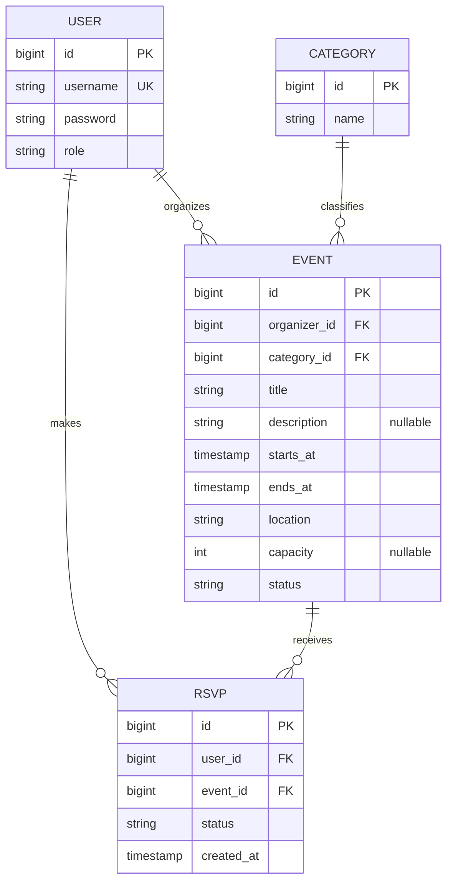

# EventHub Proposal

## 1. The pitch (one paragraph)
The API lets users create, publish and manage events, such as meetups, concerts, workshops)
and allows users to find and RSVP to them. (add more info)

## 2. Resources
| Resource | Key fields                                                                                       | Relationships                                               |
|----------|--------------------------------------------------------------------------------------------------|-------------------------------------------------------------|
| User     | id, email, displayName, role (USER/ADMIN)                                                        | A user organizes events but an user has many RSVPs          |
| Event    | id, title, description, startsAt, endsAt, location, capacity, status (Draft/Published/Cancelled) | Belongs to the organizing User, one category. Has "x" RSVPs |
| Category | id, name                                                                                         | A category has "x" number of events                         |
| RSVP     | id, userId, eventId, status (Going/Maybe/Declined), createdAt                                    | This belongs to a user and an event                         |

## 3. ER sketch
Tables, primary and foreign keys, and cardinality. Edit this Mermaid diagram (it renders on GitHub;
try changes at https://mermaid.live):

## 4. Endpoints
| Verb | Path | Auth | Purpose |
|---|---|---|---|
| GET | /api/v1/workouts?page=0&size=20 | user | list my workouts (paginated) |
| ... | ... | ... | ... |
Mark each endpoint `public`, `user`, or `admin`. Mark which collection paginates and which
filters or sorts.

## 5. Technical choices
- **Database host:** (Neon, Supabase, Railway, Atlas, ...) and why
- **OAuth2 provider:** (Google, GitHub, Auth0) and confirmation that it supports Authorization Code + PKCE from a native app
- **Repo layout:** monorepo or split, and why
These become your ADRs later.

## 6. Risks
The two things most likely to go wrong, and what you will do first to find out.

## 7. Team and Sprint 1
Who owns what in Sprint 1. Link your Project board and Sprint 1 milestone.
