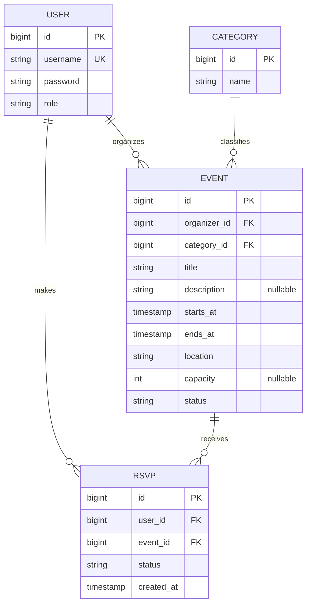

# EventHub Proposal

## 1. The pitch (one paragraph)
The API lets users create, publish and manage events, such as meetups, concerts, workshops
and allows users to find and RSVP to them. (add more info)

## 2. Resources
| Resource | Key fields                                                                                       | Relationships                                               |
|----------|--------------------------------------------------------------------------------------------------|-------------------------------------------------------------|
| User     | id, email, displayName, role (USER/ADMIN)                                                        | A user organizes events but an user has many RSVPs          |
| Event    | id, title, description, startsAt, endsAt, location, capacity, status (Draft/Published/Cancelled) | Belongs to the organizing User, one category. Has "x" RSVPs |
| Category | id, name                                                                                         | A category has "x" number of events                         |
| RSVP     | id, userId, eventId, status (Going/Maybe/Declined), createdAt                                    | This belongs to a user and an event                         |

## 3. ER sketch
Tables, primary and foreign keys, and cardinality. Edit this Mermaid diagram (it renders on GitHub;
try changes at https://mermaid.live):

## 4. Endpoints
| Verb   | Path                                                        | Auth   | Purpose                                                 |
|--------|-------------------------------------------------------------|--------|---------------------------------------------------------|
| GET    | /api/v1/events?page=0&size=20&category=&from=&sort=startsAt | public | list events published (**paginated filters:** category) |
| GET    | /api/v1/events/{id}                                         | public | event details                                           |
| POST   | /api/v1/events                                              | user   | create an event                                         |
| PUT    | /api/v1/events/{id}                                         | user   | update my event (only for organizers)                   |
| DELETE | /api/v1/events/{id}                                         | user   | delete my event (only for organizers)                   |
| GET    | /api/v1/users/me/events                                     | user   | events I organize                                       |
| POST   | /api/v1/events/{id}/rsvps                                   | user   | RSVP to an event                                        |
| DELETE | /api/v1/events/{id}/rsvps                                   | user   | cancel my RSVP                                          |
| GET    | /api/v1/events/{id}/rsvps                                   | user   | attendee  list (only for organizers)                    |
| GET    | /api/v1/categories                                          | public | list category                                           |
| POST   | /api/v1/categories                                          | admin  | create a category                                       |
| DELETE | /api/v1/admin/events/{id}                                   | admin  | remove any event (moderation)                           |
Mark each endpoint `public`, `user`, or `admin`. Mark which collection paginates and which
filters or sorts.

## 5. Technical choices
- **Database host:** Neon PostgreSQL. We chose Neon because it provides a managed PostgreSQL database that can be used by our backend without requiring us to manage the database server ourselves

- **OAuth2 provider:** Google. Google supports the OAuth 2.0 Authorization Code flow for applications, and PKCE can be used with native/mobile applications. Our Android application will use Authorization Code + PKCE for user authentication

- **Repo layout:** Monorepo. The frontend and backend will be kept in the same repository under separate folders (`/frontend` and `/backend`). This keeps the project in one place and makes it easier for the team to coordinate changes between the Android application and API.
  One important thing

## 6. Risks
The two things most likely to go wrong, and what you will do first to find out.
- **Authentication and authorization:** OAuth2 and user roles may not work correctly between the Android app and backend. We will first test the login flow with a basic authenticated API request and verify that USER and ADMIN permissions are enforced correctly.

- **Event and RSVP data:** Relationships between users, events, categories, and RSVPs could cause database or API issues. We will first create the database tables and test creating an event and submitting an RSVP to verify that the relationships and constraints work correctly

## 7. Team and Sprint 1
Who owns what in Sprint 1. Link your Project board and Sprint 1 milestone.

### Sprint 1 Ownership

- **Victor Borba:** UserDAO, UserEntity, and database setup
- **Linus Schaub:** Sign-up
- **Justin Tzeng:**  Loging page
- **Hugo Ruiz-Mireles:** GitHub Actions and CI setup

- **Project board:** https://github.com/users/Hugo-RM/projects/3/views/1
- **Sprint 1 milestone:** https://github.com/Hugo-RM/cst438-project-2/milestones
